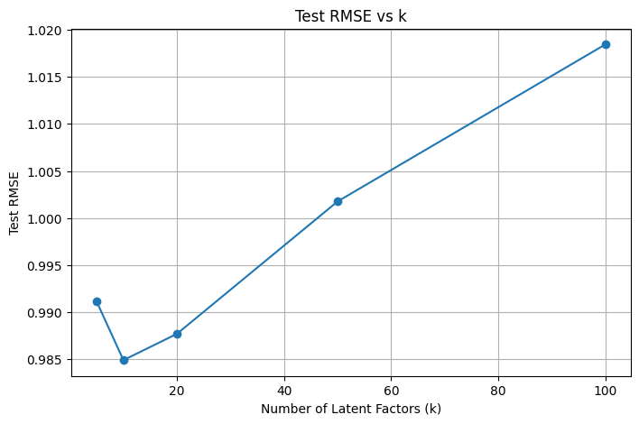
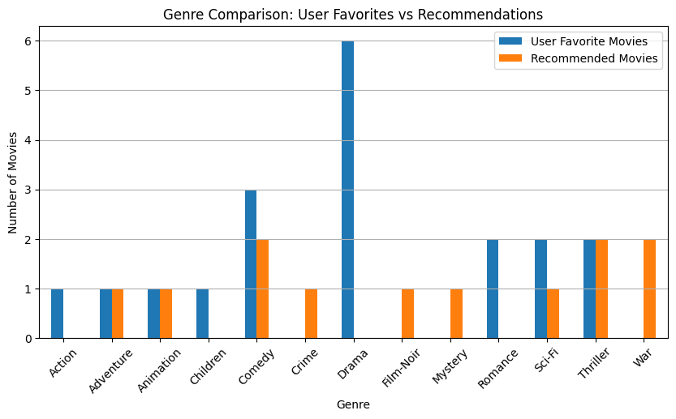
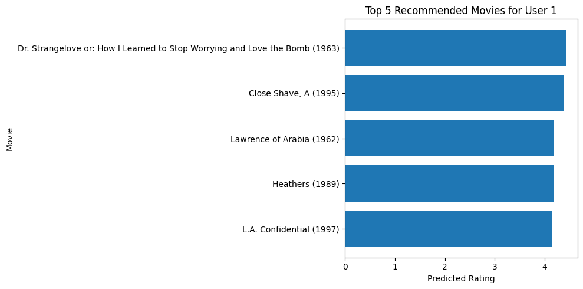

# Movie Recommendation System using SVD

This project builds a movie recommendation system using Singular Value Decomposition (SVD) and Low-Rank Approximation on the MovieLens 100K dataset.

## Dataset

- MovieLens 100K Dataset
- 943 users
- 1682 movies
- 100,000 ratings

Dataset source: https://grouplens.org/datasets/movielens/100k/

## Methods

- User-Movie Rating Matrix
- Missing Value Imputation
- Mean Centering
- Singular Value Decomposition (SVD)
- Low-Rank Approximation
- Train/Test Split
- RMSE Evaluation
- Top-5 Movie Recommendation

## Results

The model was evaluated using test RMSE with different numbers of latent factors.

| k | Test RMSE |
|---|---|
| 5 | 0.9911 |
| 10 | 0.9849 |
| 20 | 0.9877 |
| 50 | 1.0018 |
| 100 | 1.0184 |

The best result was obtained when k = 10.

## Recommendation Example

For User 1, the system recommended the following movies:

1. Dr. Strangelove or: How I Learned to Stop Worrying and Love the Bomb (1963)
2. A Close Shave (1995)
3. Lawrence of Arabia (1962)
4. Heathers (1989)
5. L.A. Confidential (1997)

## Model Selection

The test RMSE under different latent factors k.

The lowest RMSE was obtained at k = 10.

## Recommendation Analysis

Comparison between user favorite genres and recommended movie genres.

## Recommendation Example

Top 5 recommended movies for User 1.

## Tools

- Python
- NumPy
- Pandas
- Matplotlib
- Scikit-learn
- Jupyter Notebook

## Author

黃皓筠  
National Cheng Kung University
